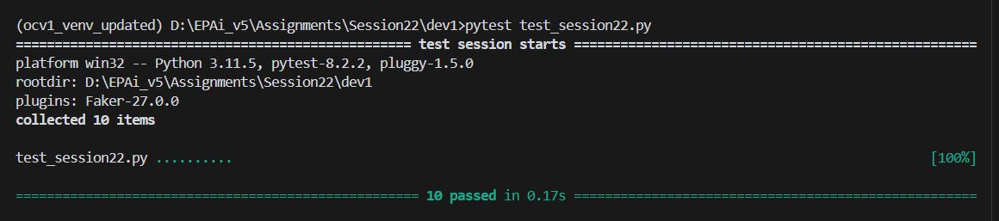
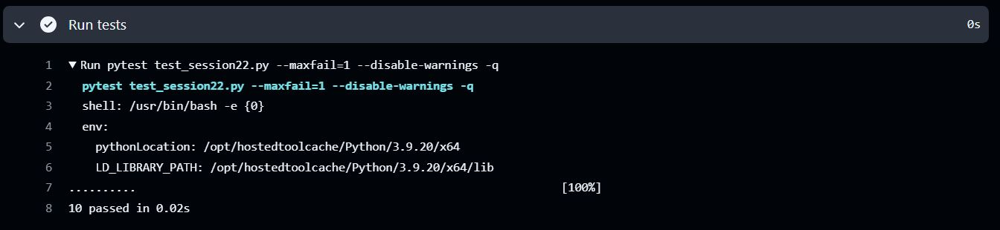

# EPAiV5-Session22 - OOP and Inheritance


## Overview

This Python module provides a set of classes that model various real-world roles and entities, including `Person`, `Student`, `Professor`, `Employee`, `StudentProfessor`, and `Location`. It demonstrates the principles of object-oriented programming (OOP) such as inheritance, encapsulation, and method overriding. The module includes features for managing and representing the attributes and details of people and locations.


## Class Structure

The project implements the following class hierarchy:

Person

├── Student

├── Professor

├── Employee

└── StudentProfessor (inherits from both Student and Professor)


## Key Classes
### 1. Person
The `Person` class serves as a foundational class that encapsulates basic attributes such as `name`, `age`, and `job`.

#### Attributes:
- `name` (str): The name of the person.
- `age` (int): The age of the person.
- `job` (str): The occupation or job title.

#### Methods:
- `__init__(name, age, job)`: Initializes a `Person` object.
- `get_details()`: Returns a formatted string describing the person's attributes.

#### Example:

```
person = Person(name="Alice", age=30, job="Engineer")
print(person.get_details())
# Output: Name: Alice, Age: 30, Job: Engineer

```

### 2. Student
Inherits from Person and adds a grade attribute specific to students.

#### Attributes:
- `grade` (str): The academic grade of the student.

#### Methods:
- `__init__(name, age, job, grade)`: Initializes a Student object.
- `get_details()`: Overrides Person's method to include the grade.

#### Example:


```
student = Student(name="Bob", age=20, job="Intern", grade="A")
print(student.get_details())
# Output: Name: Bob, Age: 20, Job: Intern, Grade: A

```

### 3. Professor
Extends Person by adding a courses attribute, which represents the courses a professor teaches.

#### Attributes:
- `courses` (list): A list of courses taught.

#### Methods:
- `__init__(name, age, job, courses)`: Initializes a Professor object.
- `get_details()`: Overrides Person's method to include courses.

#### Example:


```
professor = Professor(name="Dr. Smith", age=45, job="Professor", courses=["Math", "Physics"])
print(professor.get_details())
# Output: Name: Dr. Smith, Age: 45, Job: Professor, Courses: ['Math', 'Physics']

```

### 4. Employee
Builds on Person by introducing a department attribute, representing the employee's department.

#### Attributes:
- `department` (str): The department where the employee works.

#### Methods:
- `__init__(name, age, job, department)`: Initializes an Employee object.
- `get_details()`: Overrides Person's method to include the department.

#### Example:


```
employee = Employee(name="Jane", age=35, job="Manager", department="HR")
print(employee.get_details())
# Output: Name: Jane, Age: 35, Job: Manager, Department: HR

```

### 5. StudentProfessor
Combines roles of Student and Professor. This class demonstrates multiple inheritance, encapsulating attributes and behaviors from both parent classes.

#### Attributes:
- `courses` (list): The courses taught.
- `grade` (str): The academic grade.

#### Methods:
- `__init__(name, age, job, courses, grade)`: Initializes a `StudentProfessor` object.
- `get_details()`: Returns details of both roles.

#### Example:


```
student_professor = StudentProfessor(name="Emily", age=28, job="Researcher", courses=["AI"], grade="A")
print(student_professor.get_details())
# Output: Name: Emily, Age: 28, Job: Researcher, Courses: ['AI'], Grade: A

```

### 6. Location
Models a geographic location using attributes like name, latitude, and longitude. The class uses `__slots__` for memory optimization.

#### Attributes:
- `name` (str): The name of the location.
- `latitude` (float): The latitude coordinate.
- `longitude` (float): The longitude coordinate.

#### Methods:
- `__init__(name, latitude, longitude)`: Initializes a `Location` object.
- `get_coordinates()`: Returns the coordinates as a tuple.

#### Example:


```
location = Location(name="Central Park", latitude=40.785091, longitude=-73.968285)
print(location.get_coordinates())
# Output: (40.785091, -73.968285)

```

## Features

- Inheritance: Simplifies reuse of shared attributes and methods across subclasses.
- Method Overriding: Tailors behavior for specific subclasses.
- Multiple Inheritance: Demonstrated in `StudentProfessor`.
- Memory Optimization: `__slots__` in `Location` minimizes memory usage.
- Comprehensive test suite using pytest

## Test Resuts

#### Local PC Test Execution



#### Workflow Actions




## Usage 

The module is suitable for creating applications where detailed role-based information is needed, such as academic, organizational, or geographical software systems.


## Future Enhancements

- Add validation for attributes like age and coordinates.
- Introduce serialization methods for object persistence.
- Extend functionality for dynamic attribute management.


This module demonstrates practical OOP principles, making it a great tool for both learning and real-world applications.


---------------------------------------------------------------------------------------------------------------------------------------------------

**Submission by** - Hema Aparna M

**mail id** - mhema.aprai@gmail.com

---------------------------------------------------------------------------------------------------------------------------------------------------